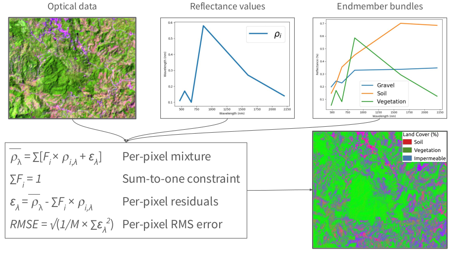

# Introduction

The contents of a satellite image pixel are rarely homogeneous. An area 30x30m in size might include:

- buildings, trees, and roads in urban environments
- grasses, soils, and char in recently burned landscapes
- trees, shade, and downed trunks in forests

These patterns all affect the reflectance measured by satellites, and it's important to be able to estimate the sub-pixel abundances of each of these land cover types to better understand environmental gradients over large areas.

## Spectral Mixture Analysis

Spectral mixture analysis quantitatively estimates the sub-pixel contents of a pixel based on a set of representaive reflectance spectra (a reference library, in other words).

Spectral mixture analysis uses an iterative, least-squares fitting approach to estimate the proportions of land cover types based on observed reflectance measurements. 

In order to run these analyses, you need:

- a high quality reference library of different land cover types
- to resample these reference data to the wavelengths of the instrument you plan to analyze

To support these analysise, `earthlib` provides a rich spectral library with thousands of [labeled reference spectra](sources.md) and tools for working with common satellite instruments.
