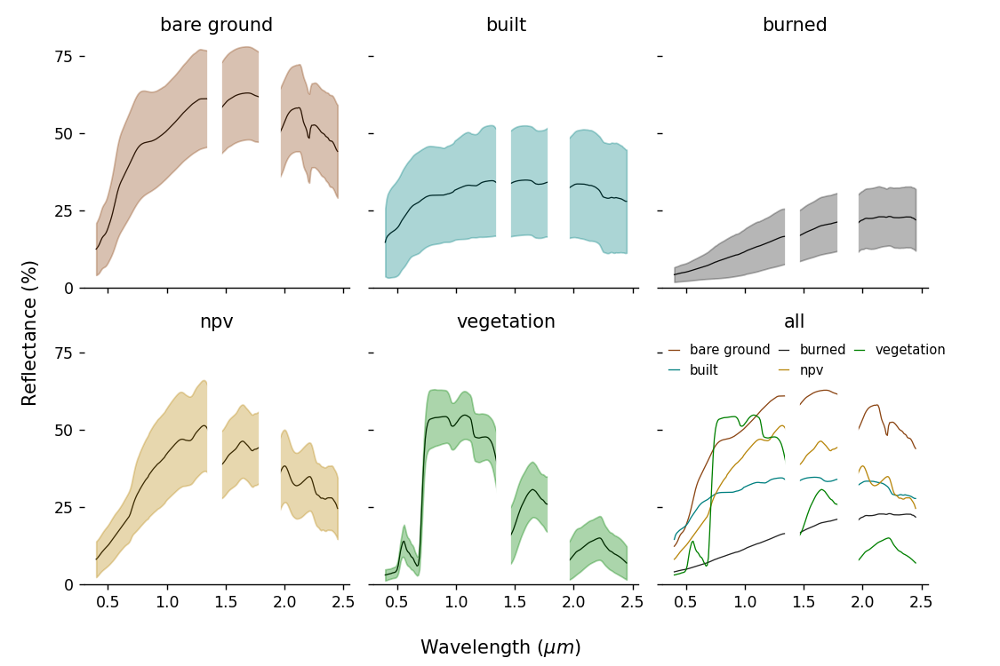
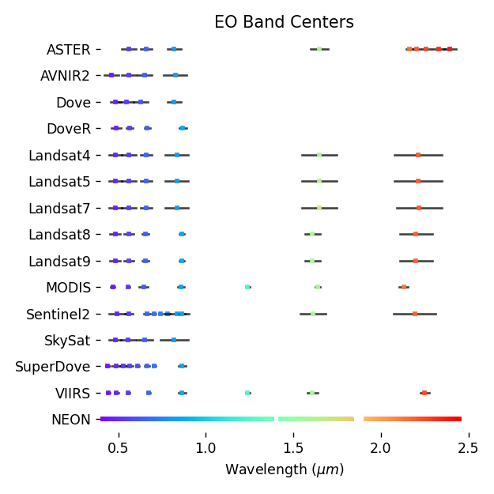

# Data Sources

`earthlib` provides a collection of spectral measurments and models from a range of data sources, as well as tools for resampling this collection to match the wavelenghts of common optical imaging sensors.

## Source libraries

The following data sources were filtered and resampled prior to inclusion in `earthlib`.

- Vegetation spectra modeled using [PROSAIL](http://teledetection.ipgp.jussieu.fr/prosail/) (using [PyPROSAIL](https://pyprosail.readthedocs.io/en/latest/))
- World Agroforestry (ICRAF) Global [Soil Spectral Library](https://www.worldagroforestry.org/sd/landhealth/soil-plant-spectral-diagnostics-laboratory/soil-spectra-library)
- [The Joint Fire Science Program](https://www.frames.gov/assessing-burn-severity/spectral-library/overview)
- UCSB's [Urban Reflectance Spectra](https://ecosis.org/package/urban-reflectance-spectra-from-santa-barbara--ca)
- UW/BNL/NASA HySPIRI [airborne calibration spectra](https://ecosis.org/package/uw-bnl-nasa-hyspiri-airborne-campaign-leaf-and-canopy-spectra-and-trait-data)
- [USGS Spectral Library Version 7](https://www.sciencebase.gov/catalog/item/5807a2a2e4b0841e59e3a18d)

## Land cover types

Below are plots for the primary land cover types included in `earthlib`.

## Supported sensors

`earthlib` supports spectral resampling to a wide range of earth observing sensors. Below is a plot with the band centers and ranges for the sensors supported by default.

Here, the black lines indicate the full-width at half-max (FWHM) of each band, and the colored squares mark the center wavelength for each band.

`NEON`, an imaging spectrometer, measures the full shortwave spectrum (400-2500 nm), using over 400 spectral bands to measure continuous spectral variation.

For sensors not specified here, users can define their own sensor specification using the `earthlib.sensors.Sensor()` class. The [API Walkthrough](api_walkthrough.ipynb) has an example.

### Measurement units

The `earthlib` spectral library is provided in units of surface reflectance, scaled as floating point values from 0-1.

Data from commonly-used sensors—like Landsat, Sentinel, and MODIS—are often provided as surface reflectance products.

These datasets can be unmixed once the data have been rescaled: they're typically provided as unsigned integer values from 0-10000.

A few data sources are not provided as surface reflectance products: `ASTER` data are provided in radiance (a physical measurement unit, uncorrected for atmospheric composition); `ALOS-AVNIR-2` data are provided in DN (raw sensor measurments).

One would have to first convert from DN to radiance (in the case of `ALOS-AVNIR-2`) then apply atmospheric correction (to convert from radiance to reflectance). This workflow isn't directly supported by `earthlib`.

### Sensors unavailable in Earth Engine

`earthlib` provides sensor definitions for `NEON` data (a set of airborne imaging spectrometers) and for a set of data from Planet's Dove constellation (`Dove`, `Dove-R`, `SuperDove`). These are not available as default Earth Engine collections.

You can, however, upload data from these providers as custom user data or from community-contributed datasets. So you can unmix these datasets if you have access to them as Earth Engine Image/Collection assets, but no default collection ID is provided by `earthlib`.

Next, learn more about the [how the earthlib API works](api_walkthrough.ipynb).
