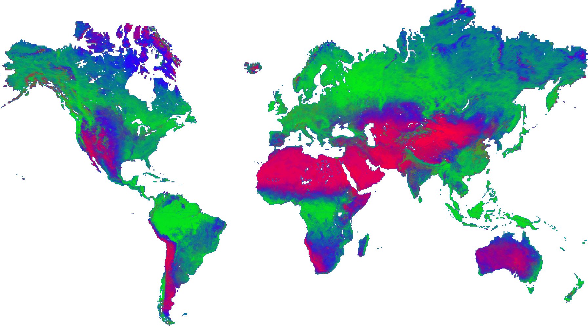

# The Earth Library



<p align="center">
  <em>A global spectral library, and earth engine tools for satellite land cover mapping..</em>
</p>

---

**Documentation**: [earth-chris.github.io/earthlib](https://earth-chris.github.io/earthlib)

**Source code**: [earth-chris/earthlib](https://github.com/earth-chris/earthlib)

---

## :earth_asia: Introduction

`earthlib` is a python package featuring a global spectral library of reference spectra, and a set of software tools for satellite-based land cover mapping in Earth Engine.

The library contains several thousand unique spectral endmembers representing green vegetation, soil, non-photosynthetic vegetation, urban materials, and burned materials. The reflectance data cover the visible to the shortwave infrared wavelengths (400-2450 nm) at 10 nm band widths.

The software tools (1) resample these data to match the wavelengths of popular satellite and airborne earth observing sensors and (2) run [spectral mixture analysis](introduction.md) in Google Earth Engine via the `earthengine` python package.

The goal is to quantify spatial and temporal patterns of change in global vegetation cover, as well as patterns of soil cover, burned area, non-photosynthetic vegetation, and impervious surfaces. With `earthlib`, you can do this using a wide variety of public satellite [data sources](sources.md).


## :seedling: Installation

This library can be installed via `pip`.

```bash
pip install earthlib
```

You can also clone the source repository and install it locally.

```bash
git clone https://github.com/earth-chris/earthlib.git
cd earthlib
pip install -e .
```

## :deciduous_tree: Developed by

[Christopher Anderson](https://cbanderson.info)[^1] [^2]

<a href="https://twitter.com/earth_chris"></a>
<a href="https://github.com/earth-chris"></a>

This work was primarily developed at the Stanford Center for Conservation Biology with the Natural Capital Project.

[^1]: [Earth Observation Lab, Planet Labs PBC](https://www.planet.com)
[^2]: [Center for Conservation Biology, Stanford University](https://ccb.stanford.edu)
